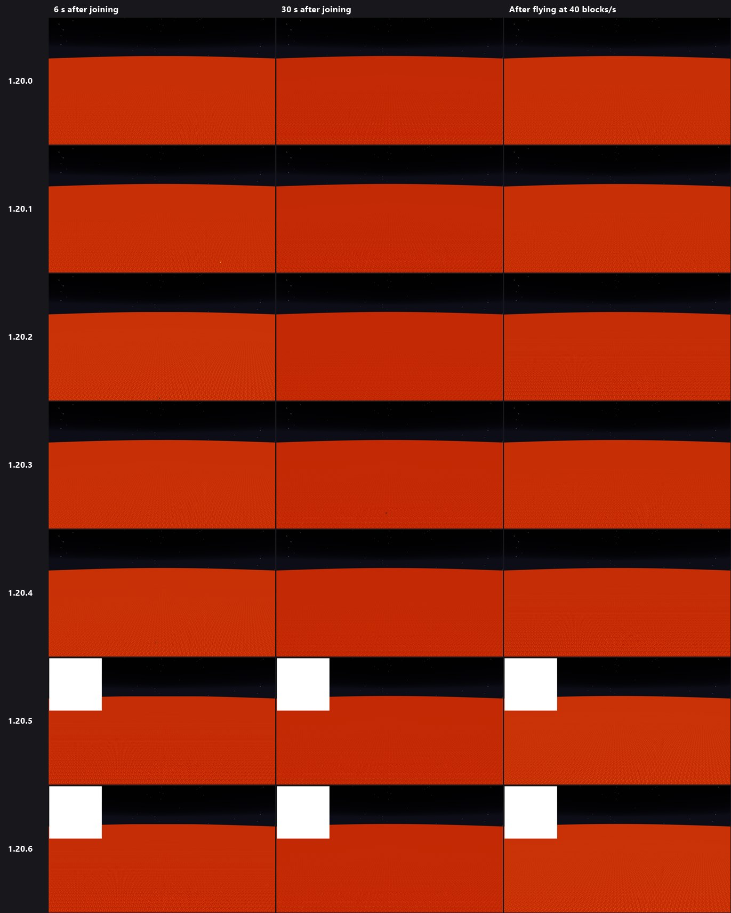

# BismuthLib 2.0
Fast colored lights for Fabric, Minecraft **1.20 - 1.20.6**.

BismuthLib 2.0 is an updated version of [BismuthLib](https://github.com/paulevsGitch/BismuthLib) by **paulevs**.
Colored light now loads almost instantly, reaches **32 chunks** and handles huge amounts of light sources
like lava lakes and nether lava oceans.


> **AI disclaimer:** the 2.0 update was made by **Claude Opus 5**, an AI model by Anthropic.
> Read the [full disclaimer](#ai-disclaimer) below.

<br/>

## Credits
- **paulevs** - creator of the original [BismuthLib](https://github.com/paulevsGitch/BismuthLib) mod.
All credit for the original idea, colored light design, shaders and resource pack format goes to them.
- **pumpkinkillerlol** - port to Minecraft 1.20 - 1.20.6 and owner of this repository.
- **Claude Opus 5** (AI model by Anthropic) - edited and updated the mod for 2.0: new light engine, 32 chunk support,
performance improvements, in-game testing and this README.

<br/>

## What's new in 2.0
- **Loads almost instantly** - light is calculated nearest to the player first and only when something changes
(a chunk loads or unloads, or a block changes). The old version re-queued 27 sections in random order every time a chunk re-rendered.
- **32 chunk range** - light data is stored in a sparse GPU texture where only sections that actually have light use memory.
The old dense texture would need about 1 GB at 32 chunks, so it was limited to 16.
- **Huge amounts of lights** - lights with the same color and radius are spread together in one pass,
so a lava lake costs about as much as a single torch. Sections with no light sources nearby are skipped almost for free.
- **Better defaults** - XZ radius goes up to 32 (old configs are moved to 32 automatically), Y radius defaults to 3,
worker threads default to your CPU cores minus 2.
- **Fixes** - removed a Mod Menu entrypoint in 1.20.3 that pointed to a missing class, and fixed the light texture
being bound one frame late after it grows.

<br/>

## Test results
Every version was built and tested in game with automated tests (development environment, same PC).

### Lava stress test
Superflat world with a lava surface everywhere, at night, render distance 32, vsync off.
The player waits while chunks load, then flies across the lava at 40 blocks per second.

**Original BismuthLib vs 2.0 on Minecraft 1.20.1:**

| | Original (16 chunk radius) | BismuthLib 2.0 (32 chunk radius) |
|---|---|---|
| All visible light calculated | never caught up (72k sections queued after 9 s) | 6.5 s, as fast as chunks arrive |
| FPS standing still | ~310-360 | ~350-415 |
| Lowest FPS flying at 40 blocks/s | 133 | 233 |
| GPU memory for light | 256 MB | 129 MB |

Lava world 6 seconds after joining (left: 2.0, right: original):
<p>


</p>

After flying across the lava at 40 blocks/s (left: 2.0, right: original):
<p>


</p>

**BismuthLib 2.0 on every Minecraft version (same test):**

| Minecraft | All 7170 lava sections lit | FPS standing still | Lowest FPS flying at 40 blocks/s | GPU memory for light | OpenGL errors |
|---|---|---|---|---|---|
| 1.20   | 6.9 s | 351-409 | 205 | 129 MB | 0 |
| 1.20.1 | 6.9 s | 357-403 | 212 | 129 MB | 0 |
| 1.20.2 | 7.8 s | 415-470 | 267 | 129 MB | 0 |
| 1.20.3 | 7.0 s | 368-415 | 288 | 129 MB | 0 |
| 1.20.4 | 7.0 s | 361-469 | 257 | 129 MB | 0 |
| 1.20.5 | 9.0 s | 327-400 | 292 | 129 MB | 0 |
| 1.20.6 | 8.0 s | 456-506 | 352 | 129 MB | 0 |

Light time is limited by how fast the world sends chunks: the light queue stayed near zero during the whole test.



### Light test
Lava pool, torches, lanterns, glowstone and crying obsidian placed next to the player, then a teleport onto a
pre-built lava field. Light was ready about 0.3 s after placing and 1-2 s after teleporting on every version.


### Color test
Closed white concrete room with no sky light, one lit stack of 4 candles per bay (white, red, orange, yellow, lime, cyan,
blue, purple, magenta). Every version shows the same colors with no bleeding between bays (image at the top of this page).

The white square in some 1.20.5 and 1.20.6 screenshots is a debug overlay that is drawn only in the development environment.

<br/>

## Installing
1. Install [Fabric Loader](https://fabricmc.net/use/) and [Fabric API](https://modrinth.com/mod/fabric-api) for your Minecraft version.
2. Put the BismuthLib 2.0 jar for your Minecraft version into your `mods` folder.

Java 17 is needed for 1.20 - 1.20.4 and Java 21 for 1.20.5 - 1.20.6.
Only tested with vanilla rendering (without Sodium, Iris or OptiFine).

<br/>

## Settings
Open **Options** and press the **BL** button.
- **XZ Radius / Y Radius** - how far colored light reaches around the player (XZ up to 32 chunks).
- **Brightness** - colored light brightness.
- **Light Type** - Fancy (smooth light that spreads around blocks) or Fast.
- **Threads** - worker threads used to calculate light.
- **Modify Light** - light passing through colored blocks (like stained glass) takes their color.
- **Bright Sources** - makes light source colors brighter.

<br/>

## Adding colored light to blocks
BismuthLib uses resource packs to add colored light to blocks. You can add custom
blocks from both mod resources and simple resource packs.

To add blocks you need to use this resource path:
```
assets/bismuthlib/lights/<your_file>.json
```

To keep files clear it is better to name them like mod_id.json, examples:
- minecraft.json;
- betterend.json;
- edenring.json.

Internal json structure should look like this:
```json
{
	"block_id_1": {
		"color": "...",
		"radius": "..."
	},
	"block_id_2": {
		"color": "...",
		"radius": "..."
	},
	"block_id_3": {}
}
```
Both "color" and "radius" tags are required.
If there are no tags ("block_id_3" in example above) light will be *removed* from that block.

Json files can override each other if they have the same name. You can also override values
in other json files if they are loaded after the file with values that you want to override.

**Color** can be:
- String color representation (examples: "ffffff" = white, "ff0000" = red);
- "provider=<index>" - this will use the block color provider (block color in mojmap) to colorize the block. Index is a layer index (for most blocks it is zero)
- Json Object - this will be used as a state map, example:
```json
"color": {
	"power=0": "ff0000",
	"power=1": "00ff00",
	"power=2": "0000ff",
	"power=3": "ffffff"
}
```
Each state in the map is defined with properties that will have light. If a block has other properties,
they will get light automatically if the state has the same properties in the table. For example, if a block with
a "power" property has a "waterlogged" property and we specified only power, all states will get light
based on power (independently of waterlogged). This is useful if a block has many properties
and you don't want to add all variations.

**Radius** can be:
- Integer value, example: "radius": 3;
- Json Object - this will be used as a state map, see description above.

You can combine state maps for both color and radius, in that case light will be added
to states that have both radius and color.

### Examples
[**Vanilla Blocks Example**](shared/resources/assets/bismuthlib/lights/minecraft.json)

#### Simple light
Will just add color to a block (to all states of the block)
```json
"minecraft:beacon": {
	"color": "9cf2ed",
	"radius": 15
}
```

#### Light with different radius
Can be used for blocks that have active and passive states (furnaces, lamps, etc.):
```json
"minecraft:blast_furnace": {
	"color": "ed5d0a",
	"radius": {
		"lit=true": 13
	}
}
```
Example for different radius values:
```json
"minecraft:respawn_anchor": {
	"color": "8308e4",
	"radius": {
		"charges=1": 3,
		"charges=2": 7,
		"charges=3": 11,
		"charges=4": 15
	}
}
```

#### Light with different colors
Provider light:
```json
"minecraft:oak_leaves": {
	"color": "provider=0",
	"radius": 3
}
```
The value after = is the provider index. For most blocks it is zero, but some blocks can have more than
one index layer.

States light:
```json
"minecraft:black_candle": {
	"color": {
		"lit=true,candles=1": "ff0000",
		"lit=true,candles=2": "ffff00",
		"lit=true,candles=3": "00ffff",
		"lit=true,candles=4": "00ff00"
	},
	"radius": {
		"lit=true,candles=1": 3,
		"lit=true,candles=2": 6,
		"lit=true,candles=3": 9,
		"lit=true,candles=4": 12
	}
}
```

<br/>

## Building
```
.\build-all.ps1        # Windows
bash build-all.sh      # Linux / macOS
```
Jars are created in `v1_20_x/build/libs`. Java 21 can build every version.

<br/>

## AI disclaimer
The 2.0 update of this mod was made by **Claude Opus 5**, an AI model created by Anthropic, at the request of the
repository owner. The AI rewrote the light engine, changed the settings, ran the in-game tests and wrote this README.

- The code was built for every supported Minecraft version and tested in game with automated tests
(results and screenshots above), but AI-written code can still contain bugs. Back up your worlds before using it.
- BismuthLib 2.0 is not made or endorsed by paulevs, the author of the original BismuthLib.
- Please report problems in the Issues tab of this repository.

<br/>

## Free to use, not for sale
The 2.0 changes were made by AI. The U.S. Copyright Office has stated that material generated by AI without enough
human authorship cannot be copyrighted, so nobody owns these changes and **anyone can use them**.

BismuthLib 2.0 is shared for free. **It is not for sale** - please do not sell it or put it behind a paywall.

License note: BismuthLib 2.0 is based on BismuthLib, Copyright (c) 2020 paulevsGitch, released under the MIT License.
The MIT license and its copyright notice in [LICENSE](LICENSE) still apply to the original code.
Copyright rules are different between countries, and this section is not legal advice.
