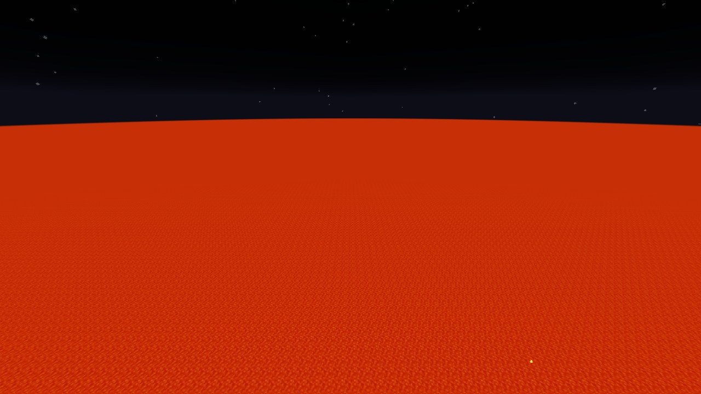
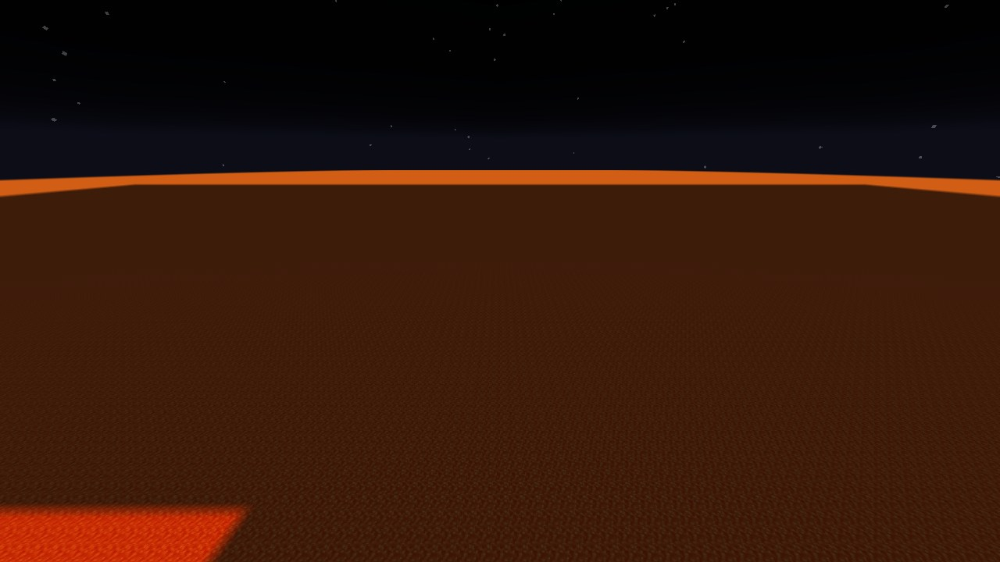
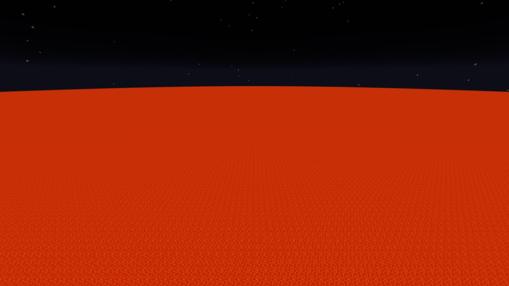
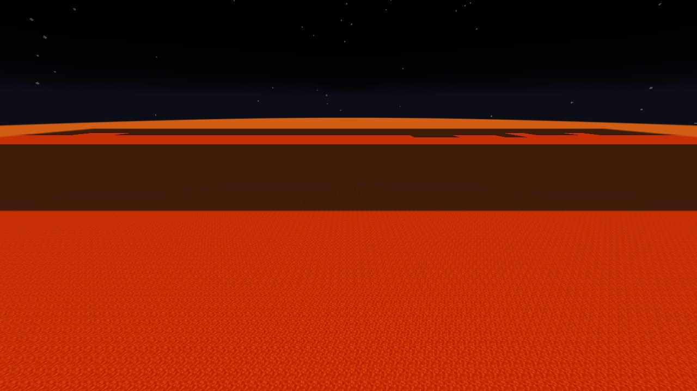
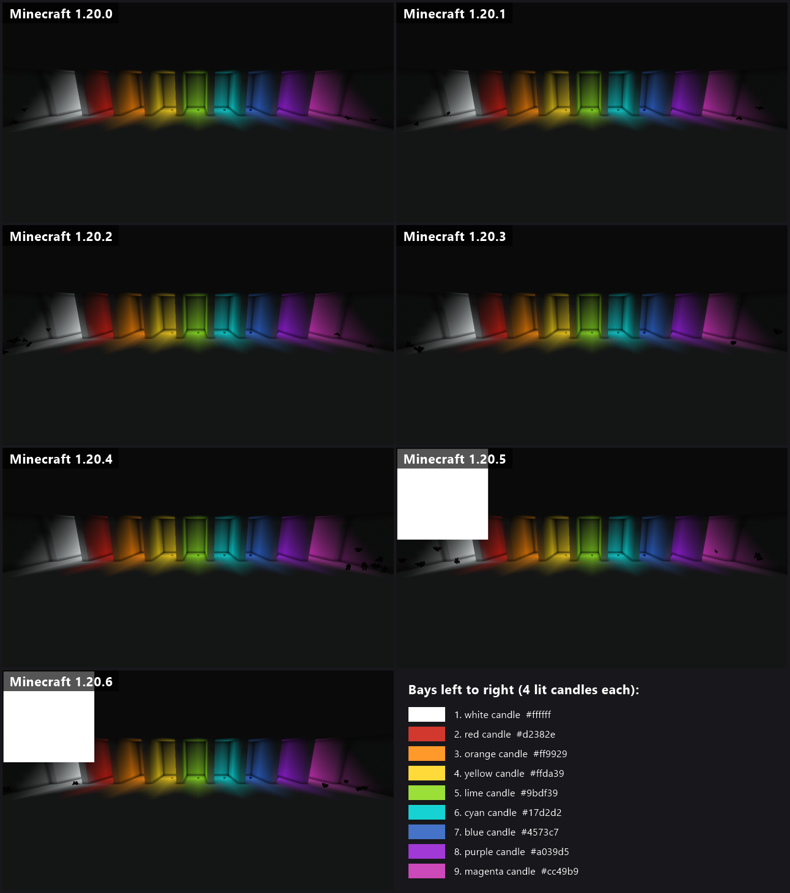
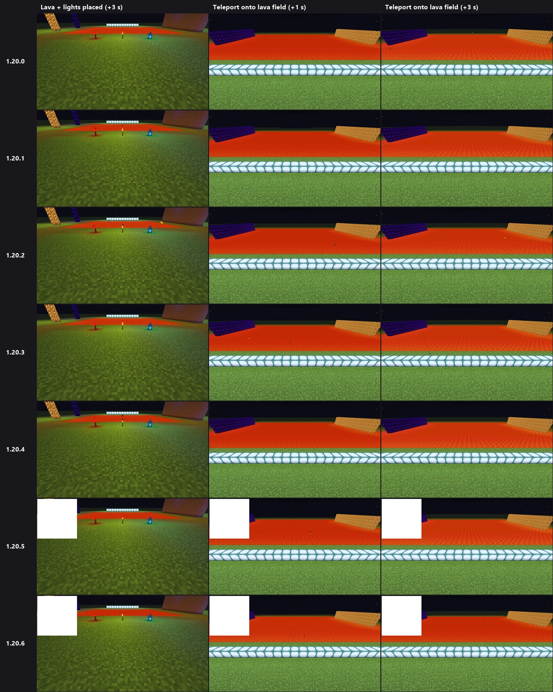

# BismuthLib
A simple client-side colored light mod/library for Fabric.
Can load information about block light colors from resourcepacks
and calculate color for blocks that don't have json-specified colors.

<br/>

## Fast light update (1.20.0 - 1.20.6)
This version reworks the light engine so colored light loads almost instantly, reaches 32 chunks
and handles huge amounts of light sources (lava lakes, nether oceans).

What changed:
- **Grouped light propagation** - lights with the same color and radius are flooded together, so a lava lake
costs about as much as a single torch. Sections without light sources nearby are skipped using the chunk palette.
- **Smarter updates** - light is recalculated only when a chunk loads/unloads or a block changes, nearest sections
first. Previously every chunk re-render queued 27 sections in random order.
- **Sparse light texture** - only sections that contain light use GPU memory, which makes a 32 chunk radius possible
(the old dense texture would need about 1 GB).
- XZ radius slider goes up to 32 (old configs are moved to 32 automatically), Y radius defaults to 3,
worker threads default to CPU cores - 2.

### Test results
Automated in-game tests in the development environment: superflat world with a lava surface everywhere, night,
render distance 32, vsync off. The player waits while chunks load, then flies across the lava at 40 blocks/s.

Original vs this version on 1.20.1:

| | Original (16 chunk radius) | This version (32 chunk radius) |
|---|---|---|
| All visible light calculated | never caught up (72k sections queued after 9 s) | 6.5 s, as fast as chunks arrive |
| FPS standing still | ~310-360 | ~350-415 |
| Lowest FPS flying at 40 blocks/s | 133 | 233 |
| GPU memory for light | 256 MB | 129 MB |

This version on every Minecraft version (same test):

| Minecraft | All 7170 lava sections lit | FPS standing still | Lowest FPS flying at 40 blocks/s | GPU memory for light |
|---|---|---|---|---|
| 1.20   | 6.9 s | 351-409 | 205 | 129 MB |
| 1.20.1 | 6.9 s | 357-403 | 212 | 129 MB |
| 1.20.2 | 7.8 s | 415-470 | 267 | 129 MB |
| 1.20.3 | 7.0 s | 368-415 | 288 | 129 MB |
| 1.20.4 | 7.0 s | 361-469 | 257 | 129 MB |
| 1.20.5 | 9.0 s | 327-400 | 292 | 129 MB |
| 1.20.6 | 8.0 s | 456-506 | 352 | 129 MB |

Light time is limited by how fast the world sends chunks: the light queue stayed near zero during the whole test.

Lava world 6 seconds after joining (left: this version, right: original):
<p>


</p>

After flying across the lava at 40 blocks/s (left: this version, right: original):
<p>


</p>

Color test on all versions (closed white room, one lit 4-candle stack per bay):



Light test on all versions (lights placed next to the player, teleport onto a lava field):



The white square in 1.20.5 and 1.20.6 screenshots is a debug overlay that is drawn only in the development environment.

<br/>

### How to add light to blocks:
BismuthLib use resourcepacks to add color light to blocks. You can add custom
blocks from both mod resources and simple resourcepack.

To add blocks you need to use this resource path:
```
assets/bismuthlib/lights/<your_file>.json
```

To keep files clear it is better to name them like mod_id.json, examples:
- minecraft.json;
- betterend.json;
- edenring.json.

Internal json structure should look like this:
```json
{
	"block_id_1": {
		"color": "...",
		"radius": "..."
	},
	"block_id_2": {
		"color": "...",
		"radius": "..."
	},
	"block_id_3": {}
}
```
Both "color" and "radius" tags are required.
If there are no any tags ("block_id_3" in example above) light will be *removed* from that block.

Json files can override each other if they have same name. You can also override values
in other json files if they will be loaded after file with values that you want to override.

**Color** can be:
- String color representation (examples: "ffffff" = white, "ff0000" = red);
- "provider=<index>" - this will use block color provider (block color in mojmap) to colorize block. Index is a layer index (for most blocks it is zero)
- Jsom Object - this will be used as a state map, example:
```json
"color": {
	"power=0": "ff0000",
	"power=1": "00ff00",
	"power=2": "0000ff",
	"power=3": "ffffff"
}
```
Each state in map is defined with properties that will have light, if block have other properties - 
they will get light automatically if state has same properties in table. For example if block with
"power" property has "waterlogged" property, and we specified only power - all states will get light
based on power (independently of waterlogged). This is useful if block have many properties,
and you don't want to add all variation. 

**Radius** can be:
- Integer value, example: "radius": 3;
- Jsom Object - this will be used as a state map, see description above.

You can combine state maps for both color and radius, in that case light will be added
to states that have both radius and color.

<br/>

### Examples
[**Vanilla Blocks Example**](https://github.com/paulevsGitch/BismuthLib/blob/main/src/main/resources/assets/bismuthlib/lights/minecraft.json)

#### Simple light
Will just add color to block (to all states of block)
```json
"minecraft:beacon": {
	"color": "9cf2ed",
	"radius": 15
}
```

#### Light with different radius
Can be used for blocks that have active and passive states (furnaces, lamps, etc.):
```json
"minecraft:blast_furnace": {
	"color": "ed5d0a",
	"radius": {
		"lit=true": 13
	}
}
```
Example for different radius values:
```json
"minecraft:respawn_anchor": {
	"color": "8308e4",
	"radius": {
		"charges=1": 3,
		"charges=2": 7,
		"charges=3": 11,
		"charges=4": 15
	}
}
```
#### Light with different colors
Provider light:
```json
"minecraft:oak_leaves": {
	"color": "provider=0",
	"radius": 3
}
```
Value after = is provider index. For most bloks it is zero, but some blocks can have more than
one index layer.

States light:
```json
"minecraft:black_candle": {
	"color": {
		"lit=true,candles=1": "ff0000",
		"lit=true,candles=2": "ffff00",
		"lit=true,candles=3": "00ffff",
		"lit=true,candles=4": "00ff00"
	},
	"radius": {
		"lit=true,candles=1": 3,
		"lit=true,candles=2": 6,
		"lit=true,candles=3": 9,
		"lit=true,candles=4": 12
	}
}
```